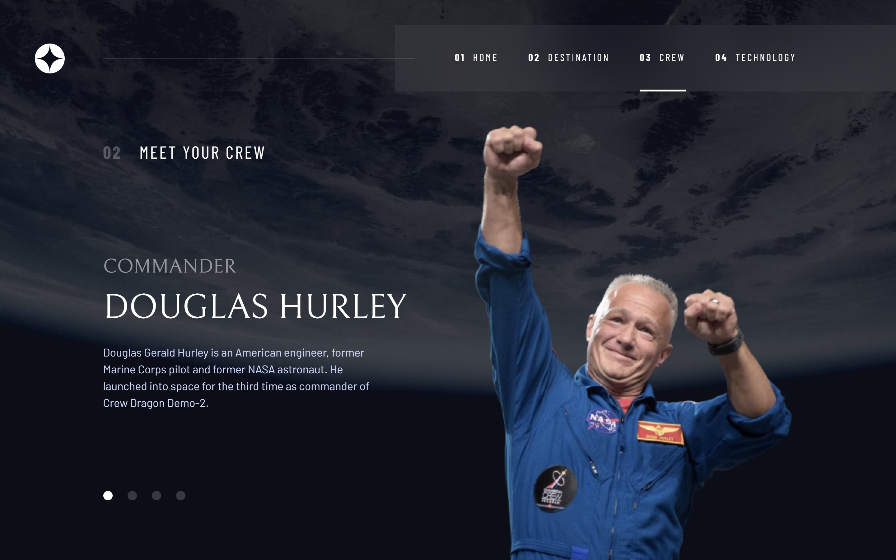

# Frontend Mentor - Space tourism website solution

This is a solution to the [Space tourism website challenge on Frontend Mentor](https://www.frontendmentor.io/challenges/space-tourism-multipage-website-gRWj1URZ3). Frontend Mentor challenges help you improve your coding skills by building realistic projects. 

## Table of contents

- [Overview](#overview)
  - [The challenge](#the-challenge)
  - [Screenshot](#screenshot)
  - [Links](#links)
- [My process](#my-process)
  - [Built with](#built-with)
  - [What I learned](#what-i-learned)
  - [Continued development](#continued-development)
- [Author](#author)

**Note: Delete this note and update the table of contents based on what sections you keep.**

## Overview

### The challenge

Users should be able to:

- View the optimal layout for each of the website's pages depending on their device's screen size
- See hover states for all interactive elements on the page
- View each page and be able to toggle between the tabs to see new information

### Screenshot

### Links

- Solution URL: [https://github.com/yukilun/space-tourism-website/](https://github.com/yukilun/space-tourism-website/)
- Live Site URL: [https://yukilun.github.io/space-tourism-website//](https://yukilun.github.io/space-tourism-website//)

## My process

### Built with
- [Vue.js](https://vuejs.org/) - JS library
- [Vue Router](https://router.vuejs.org/) - Official router for Vue.js 
- [Tailwind CSS](https://tailwindcss.com/) - CSS Framework

### What I learned

- Transformed existing responsive web design (Figma) into code
- Utilized Vue + Vue router for single-page application (SPA) development
- Create customize Vue composables for swiping events

### Continued development

- Transition effect when swiping from 1 element to another

## Author

- Website - [Yuki Lun](https://www.yukilun.com)
- Frontend Mentor - [@yukilun](https://www.frontendmentor.io/profile/yukilun)